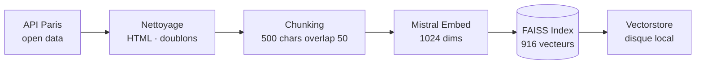
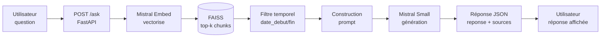

# Puls-Events RAG — Assistant Intelligent Culturel

> POC d'un système RAG (Retrieval-Augmented Generation) pour recommandations d'événements culturels parisiens  
> Mission freelance pour **Puls-Events** | Formation AI Engineer

---

## Contexte

Puls-Events développe une plateforme de recommandations culturelles personnalisées. Ce POC démontre la faisabilité d'un chatbot intelligent capable de répondre aux questions des utilisateurs sur les événements culturels à venir, en s'appuyant sur les données de l'API open data de la Ville de Paris.

---

## Architecture UML

### Pipeline de build — indexation



### Pipeline de requête — chatbot RAG



### Composants détaillés

| Composant | Technologie | Rôle |
|-----------|-------------|------|
| Données | API open data Ville de Paris | Source événements culturels |
| Embeddings | Mistral Embed API | Vectorisation textes (1024 dims) |
| Vectorstore | FAISS CPU | Recherche par similarité sémantique |
| LLM | Mistral Small | Génération réponses naturelles |
| API | FastAPI | Exposition REST avec Swagger |
| Conteneur | Docker | Déploiement reproductible |

---

## Stack technique

- `faiss-cpu` — index vectoriel local
- `mistralai` via `requests` — embeddings + génération
- `fastapi` + `uvicorn` — API REST
- `pandas` + `numpy` — manipulation données
- `docker` — conteneurisation
- `pytest` — tests unitaires

---

## Structure du projet

```
puls-events-rag/
│
├── api/
│   ├── __init__.py
│   └── main.py              # API FastAPI — /health /ask /rebuild
│
├── scripts/
│   ├── __init__.py
│   └── build_index.py       # Build index FAISS depuis API Paris
│
├── tests/
│   ├── __init__.py
│   ├── test_collect.py      # Tests récupération données
│   ├── test_clean.py        # Tests nettoyage
│   ├── test_vectorize.py    # Tests vectorisation
│   ├── test_api.py          # Tests endpoints API
│   └── test_evaluate.py     # Tests évaluation RAG
│
├── notebooks/
│   └── system_rag.ipynb     # Développement Colab étape par étape
│
├── docs/
│   ├── uml_architecture.png # Schéma UML exporté
│   └── rapport_technique.md # Rapport technique
│
├── data/                    # Données (non versionnées)
├── vectorstore/             # Index FAISS (généré par build_index.py)
│
├── Dockerfile
├── docker-compose.yml
├── requirements.txt
├── .env.example
├── .gitignore
└── README.md
```

---

## Lancement rapide

### 1. Configuration

```bash
git clone https://github.com/ton-user/puls-events-rag.git
cd puls-events-rag
cp .env.example .env
# Editer .env et renseigner MISTRAL_API_KEY
```

### 2. Installation

```bash
pip install -r requirements.txt
```

### 3. Build de l'index FAISS

```bash
python scripts/build_index.py
```

### 4. Lancer l'API

```bash
# En local
uvicorn api.main:app --host 0.0.0.0 --port 8000 --reload

# Via Docker Compose
docker-compose up
```

### 5. Tester l'API

```bash
curl http://localhost:8000/health
curl -X POST http://localhost:8000/ask \
  -H "Content-Type: application/json" \
  -d '{"question": "Quels concerts sont disponibles a Paris ?", "k": 3}'
```

Documentation Swagger : **http://localhost:8000/docs**

### 6. Tests unitaires

```bash
pytest tests/ -v
```

---

## Endpoints API

| Méthode | Route | Description | Codes |
|---------|-------|-------------|-------|
| GET | `/health` | État de l'API et de l'index FAISS | 200 |
| POST | `/ask` | Question → réponse RAG augmentée | 200, 400, 502 |
| POST | `/rebuild` | Recharge l'index depuis le disque | 200, 500 |
| GET | `/docs` | Documentation Swagger interactive | 200 |

---

## Résultats & Métriques

| Métrique | Valeur |
|----------|--------|
| Événements indexés | 498 |
| Chunks vectorisés | 916 |
| Dimension vecteurs | 1024 |
| Score FAISS moyen | 0.45–0.50 |
| Temps de réponse | < 2s |
| Tests unitaires | 100% passés |

---

## Limites connues

- Index statique — rebuild manuel nécessaire pour mise à jour
- Filtrage temporel basé sur `date_debut`
- Pas d'historique de conversation multi-tours
- Couverture Paris uniquement

---

## Perspectives d'amélioration

- Scheduler de rebuild automatique
- Extension multi-villes
- Index hybride dense + sparse BM25
- Déploiement cloud (AWS ECS / GCP Cloud Run)

---

## Auteur

Data Scientist Freelance — Mission Puls-Events | Formation AI Engineer